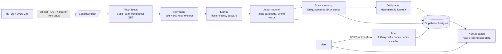

# SignalDesk

**Your watchlist's market news, explained with receipts.**

Pick the assets you follow (EUR/USD, gold, oil, the S&P 500, NVIDIA, Bitcoin, the Fed, the ECB...). SignalDesk reads central-bank and market headlines every two hours and works out which assets each article is about. It then judges the stance for each asset (Gold: bullish; Fed: hawkish) and gives you a 60-second Today page:

- a short brief where every line is cited,
- a daily **Mood** per asset with an honest confidence level,
- a 7-day trend,
- the top stories, grouped across outlets.

Tap any citation to see the exact sentences it came from, highlighted, with a link to the original.

**Who it helps:** finance students, new retail investors, and busy people who want a 60-second read of what moved their assets and why.

**Live demo:** https://signaldesk-inky.vercel.app · **Screenshots / gif:** _(placeholder)_

> Market information only. Not financial advice. Headlines belong to their publishers.

---

## 1. Architecture



Everything left of the database runs in the background. Pages only read precomputed rows, so a user never waits for fetching or AI. The only model call a user can trigger is their daily brief, which is cached and rate limited.

## 2. Architecture principles

1. **Deterministic where possible, AI where it adds value.** Asset detection uses a curated alias catalogue (`src/config/assets-seed.ts`), which is fast, free and predictable. Story grouping and the daily mood are plain code. The LLM is used for two things only: judging stance and writing the brief.
2. **Evidence by construction.** The model never writes quotes. It sees numbered sentences `[S1]..[Sn]` and returns sentence **IDs**, and code looks the real sentences up in its own stored copy. An ID that does not exist fails validation, so invented evidence cannot be shown.
3. **Honest uncertainty.** When the sentences do not clearly support a direction, the stance is **unclear**. Unclear stances never move the mood, and weak data is shown as low confidence.
4. **Ingestion is a background job.** pg_cron triggers it; pages read results.
5. **Stance labels fit the asset type.** Central banks are hawkish or dovish. Currencies, commodities, indices, stocks and crypto are bullish or bearish. All types also have neutral and unclear.
6. **Respect sources.** SignalDesk stores only titles, a ≤500-character excerpt and the few relevant sentences, and always links to the original. It never republishes full articles.

## 3. Stances, mood and confidence

| Asset type | Allowed stances |
|---|---|
| central_bank | hawkish (tighter policy), dovish (looser policy), neutral, unclear |
| currency_pair, commodity, index, stock, crypto | bullish (upward pressure), bearish (downward pressure), neutral, unclear |

For a currency pair BASE/QUOTE, bullish means the base currency strengthens. For example, a stronger yen is **bearish** for USD/JPY.

**Daily mood** (`src/lib/mood/compute.ts`, parameters in `src/config/mood.ts`), per asset per UTC day:

1. value: bullish/hawkish = +1, bearish/dovish = −1, neutral = 0; **unclear and failed are excluded**.
2. **One vote per (story, source)**: an outlet repeating the same story counts once (its strongest signal).
3. weight = `strength / 3 × 0.5^(age_hours / 24) × 1 / (votes from that source that day)`. Age is measured to "now" for today and to the end of the day for past days.
4. `score = Σ(weight × value) / Σ(weight)`, clamped to [−1, 1] (0 if all weights are 0).
5. `agreement` = share of votes whose sign matches the score's sign.
6. **Confidence**: high if ≥ 3 distinct sources and agreement ≥ 0.7; medium if ≥ 2 sources; otherwise low.

**What "unclear" means.** The model is told to answer unclear whenever the sentences do not clearly indicate a direction for this specific asset (an event announcement, a merger approval, a conference). Unclear is a correct answer, not a failure: the evaluation measures how often the model says it when it should.

## 4. Evidence by sentence ID: why quotes cannot be invented

1. At ingest, the title becomes `S1` and the excerpt's sentences `S2..Sn`. For each matched asset, SignalDesk stores only the sentences that mention it plus one neighbour on each side (max 6, ≤ 400 chars each) in `asset_mentions.sentences`.
2. The stance prompt contains only those numbered sentences, inside `<sentences>` tags declared as untrusted data.
3. The zod schema is built **per call** from the stored IDs: `evidence_ids` must be 1–3 IDs from that set, and `stance` must be allowed for the asset type. A violation is retried once with the validation error, then recorded as `failed`.
4. The UI renders evidence by looking the IDs up in `asset_mentions`. The model's output never contains quote text to render. The brief is checked the same way: every bullet's `article_ids` must be among the signals the model was given, and its evidence text is looked up from the database.

## 5. Stance evaluation

`npm run eval` runs the **production** stance step (same prompts, schema and checks) on `eval/stance_cases.json` and writes `eval/results.json`.

| Model | Cases | Accuracy | Unclear recall / precision | Evidence validity | Failed | Avg latency | Calls | Est. cost |
|---|---|---|---|---|---|---|---|---|
| openai/gpt-oss-120b (prompt v1) | 30 | **100%** (30/30) | 100% / 100% | **100%** | 0 | 2.8 s | 51 (0 schema retries, 21 rate-limit retries) | $0.0044 |

Per stance: bullish 6/6, bearish 8/8, hawkish 4/4, dovish 3/3, neutral 4/4, unclear 5/5.

**Read this honestly:**

- The 30 cases are short, synthetic, mostly clear-cut snippets written for this project, not real feed items. A perfect score shows the pipeline and prompt behave correctly on unambiguous inputs. It does **not** show accuracy on messy real headlines.
- The next step is 50+ labelled real items, including hard ones: mixed signals, indirect mentions, and currency pairs where the news is about the quote currency.
- ⚠ **Label review:** the case labels were drafted with AI assistance. **They have not yet been reviewed and corrected by hand by the project author.** Review `eval/stance_cases.json` before citing these numbers, and replace this note with "Labels reviewed and corrected by hand on <date>".
- The rate-limit retries come from Groq's free tier (8,000 tokens per minute for this model). The wrapper backs off and retries automatically.

## 6. Setup

1. **Supabase project.** Enable the **pg_cron** and **pg_net** extensions under Database → Extensions.
   - If the project previously hosted LinkPulse, run `supabase/reset_linkpulse.sql` once first. It drops the old tables.
   - Then run the migrations in order in the SQL editor, or with the Supabase CLI: `001_tables.sql`, `002_rls.sql`, `003_seed_assets.sql`.
   - `004_cron.sql` runs after you deploy (step 8).
2. **Auth.** Authentication → Sign In / Providers → Email: enable email + password.
   - For a quick demo you may turn off "Confirm email". Otherwise, under Authentication → URL Configuration, set the **Site URL** to your app URL and add `http://localhost:3000/auth/callback` and `https://<your-app>/auth/callback` to the **Redirect URLs**.
3. **`.env.local`** (copy from `.env.example`):
   - Supabase URL, anon key and service-role key (Project Settings → API Keys).
   - `CRON_SECRET` from `npm run gen-secret`.
   - `APP_BASE_URL=http://localhost:3000`.
   - `ADMIN_EMAILS` (your email, so you can trigger the job while logged in).
   - Optionally `GROQ_API_KEY`.
4. Install and load the catalogue:
   ```bash
   npm install
   ```
   ```bash
   npm run seed
   ```
   The seed is idempotent. `npm run seed -- --write-sql` regenerates `003_seed_assets.sql` from the same config; a test keeps them in sync.
5. Run the background job once locally, with a 10-minute time budget:
   ```bash
   npm run ingest
   ```

**Model note.** The spec's default, `llama-3.3-70b-versatile`, returns *404 model does not exist* on Groq for this account. SignalDesk therefore defaults to **`openai/gpt-oss-120b`**, Groq's current large general-purpose model, with `reasoning_effort: "low"` so its hidden reasoning does not use up the small token budgets.
- Change the model with `GROQ_MODEL`.
- Price defaults (`$0.15` in / `$0.75` out per million tokens) are estimates; check your Groq console and adjust `GROQ_PRICE_*`.

**Sources** (each fetched once before seeding, and kept only if it returned valid RSS/Atom with items from the last 7 days):

| Source | Kind |
|---|---|
| Federal Reserve press releases | central_bank |
| European Central Bank press | central_bank |
| Bank of England news | central_bank |
| CNBC Finance | markets |
| CNBC Economy | news |
| MarketWatch Top Stories | markets |
| FXStreet | markets |
| CoinDesk | markets |
| OilPrice.com | markets |
| BBC Business | news |

In production, **FXStreet answers HTTP 403 to requests from Vercel's datacenter IPs** (it works from a home connection). The job counts the failure and keeps going; after 5 consecutive failures the source is deactivated automatically and logged. Rejected at verification: *MarketWatch MarketPulse* (last item over a year old) and *Fed monetary-policy-only feed* (nothing in the last 7 days; covered by the all-releases feed). A live dry run fetched all 10 feeds: 159 recent articles, 60 with at least one asset mention.

## 7. Run, test, eval

```bash
npm run dev
```
```bash
npm run check
```
```bash
npm run ingest
```
```bash
npm run eval
```

- `npm run dev`: app at http://localhost:3000.
- `npm run check`: typecheck, lint and unit tests (no keys, no network).
- `npm run ingest`: fetch, stories, assets, stances and mood, run locally. Add `-- --no-score` to skip the model.
- `npm run eval`: stance evaluation (needs `GROQ_API_KEY`).

Without `GROQ_API_KEY`, the job still ingests, groups stories and detects assets. The UI shows mentions without stances and an "AI scoring offline" label, and the brief falls back to a template built from mood data.

## 8. Deploy to Vercel

1. Push to GitHub, then import the repo in Vercel (framework: Next.js).
2. Set the env vars from `.env.example` with the production `APP_BASE_URL` (`https://<your-app>.vercel.app`), then deploy.
3. In Supabase, add `https://<your-app>.vercel.app/auth/callback` to the Auth redirect URLs.
4. Store the cron target and secret in Vault. Never put them in git:
   ```sql
   select vault.create_secret('https://<your-app>.vercel.app', 'app_base_url');
   select vault.create_secret('<same value as CRON_SECRET>', 'cron_secret');
   ```
5. Run `supabase/migrations/004_cron.sql`.
6. Trigger one ingest in production, either with the bearer:
   ```bash
   curl -X POST -H "Authorization: Bearer $CRON_SECRET" https://<your-app>.vercel.app/api/jobs/ingest
   ```
   or by waiting for the next scheduled run.

**Why pg_cron and not Vercel Cron?** Vercel Hobby cron runs at most once a day; news needs every 2 hours. pg_cron calls the endpoint through pg_net, reading the URL and bearer from Vault at run time.

**Throughput note.** A run scores up to `MAX_STANCE_CALLS_PER_RUN` pairs within a ~45 s budget, two at a time. On Groq's free tier (8,000 tokens per minute) that is roughly 15–20 pairs per run. Pairs not reached wait for the next run, and `npm run ingest` locally can backfill with a longer budget.

## 9. Security

**Secrets**
- `.gitignore` was the first file. It excludes `.env*` (except `.env.example`, placeholders only), build output and editor files.
- Only the Supabase URL and anon key are `NEXT_PUBLIC_`. Every module using the service role, Groq or secrets imports `server-only`, so importing it from browser code fails the build.
- The environment is validated with zod at boot (`instrumentation.ts`) and fails fast, naming the variable but never its value.
- `npm run gen-secret` makes 32-byte secrets.
- Tracked files are scanned for `eyJ`, `gsk_`, `service_role` and `postgres://` before every commit.

**Authorization**
- RLS is enabled on every table.
- News tables (sources, assets, aliases, articles, stories, mentions, signals, mood) are SELECT-only for everyone.
- `watchlists` and `user_settings` are readable and writable only for the owner (`user_id = auth.uid()`). A database trigger caps a watchlist at 20 assets.
- `briefs` are readable by their owner and written only by the server.
- `llm_calls` and `job_runs` have no user access.
- Table-level INSERT/UPDATE/DELETE is revoked from `anon` and `authenticated`, except the two user-owned tables.
- Every route and server action derives the user from the session, never from the body. `/api/brief` strips any `user_id` field.
- The ingest job requires `Bearer CRON_SECRET`, compared with `timingSafeEqual` after an equal-length check, or a logged-in email listed in `ADMIN_EMAILS`. A wrong bearer never falls back to the session.

**Outbound fetching**
- Only feed URLs stored in `sources` are fetched, over https only, with no URL credentials and the default port only.
- Every hostname is resolved first, and all addresses must be public: private, loopback, link-local/metadata (169.254.169.254, fd00:ec2::254), CGNAT, multicast, reserved and IPv4-mapped forms are blocked. The socket is then **pinned to the checked IP**, so DNS rebinding cannot swap it.
- At most 3 redirects, each re-checked the same way.
- 10 s timeout, 2 MB cap, concurrency 4.
- Polite User-Agent with the app URL, and `If-None-Match` / `If-Modified-Since`.
- A source is deactivated after 5 consecutive failures.

**Input and output**
- zod validates every body, server action, env var and LLM output.
- Asset slugs are checked against the regex and the catalogue.
- The brief is limited to 10 generations per user per day. Global daily LLM cap: `MAX_LLM_CALLS_PER_DAY`.
- Security headers: CSP (`default-src 'self'`; connect-src limited to Supabase HTTPS/WSS; `frame-ancestors 'none'`; inline script/style only because Next.js and recharts need them; `unsafe-eval` in dev only), `X-Frame-Options: DENY`, `nosniff`, `strict-origin-when-cross-origin`, and a Permissions-Policy that disables camera, microphone and geolocation.
- Clients see only generic error messages. Server logs carry short codes, never secrets or prompts.
- All text is rendered by React, never with `dangerouslySetInnerHTML` (lint rule `react/no-danger`).
- Links are rendered only for http/https URLs, with `rel="noopener noreferrer nofollow"`.

**LLM safety**
- Article text is untrusted. It is wrapped in `<sentences>` / `<signals>` with angle brackets neutralised, and the system prompts say it is data, never instructions.
- The model has no tools, no DB, network or filesystem access. Its output is a zod-validated object with whitelisted enums and IDs, which code checks against stored data.
- Evidence is looked up by sentence ID, so quotes cannot be invented. Brief bullets are dropped if they cite unknown articles, mention non-watchlist assets, or contain advice words (buy, sell, should, guaranteed, will rise, will fall, price target).
- LLM output is never evaluated, executed or used to build SQL.
- Every call is logged to `llm_calls` (hash, tokens, cost, status; never keys, headers or prompts).
- Tests include an injection fixture: an article that tells the model to label everything bullish and cite `S9`.

**Supply chain.** Exact pinned versions, a committed `package-lock.json`, only imported packages, and `npm audit` reports **0 vulnerabilities**.

## 10. Scaling

- **Ingest:** one queue message per feed, so feeds are fetched and retried independently. Add more sources through a licensed news API.
- **Clustering:** embeddings for story clustering and multilingual support, replacing title shingles.
- **Models:** per-asset or finance-tuned classifiers (e.g. FinBERT-style) evaluated against the LLM on a labelled set, using the LLM only where it wins.
- **Serving:** cache briefs per watchlist hash across users. Partition `articles` by month with retention.
- **Delivery:** email or push digests from the same precomputed data.

## 11. Known limitations

- RSS summaries are short, so a stance rests on a handful of sentences.
- Alias matching misses indirect mentions ("the world's largest chipmaker") and can catch loose ones ("the euro area" counts as EUR/USD; "gold medal" as gold).
- Stance describes what news *says*, not what prices *did*. There is no price data.
- English only. Days are UTC.
- The free Groq tier limits how many stances are scored per run (see §8).

## 12. Disclaimer

Market information only. Not financial advice. Headlines belong to their publishers; SignalDesk stores short excerpts and always links to the original. AI output assists reading and is never a recommendation. MIT licensed.
